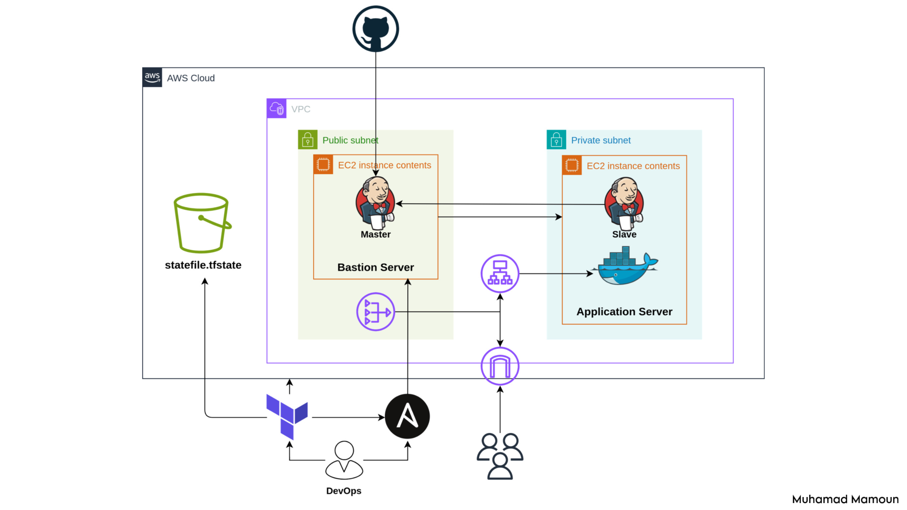

# Secure AWS CI/CD Infrastructure with Terraform, Ansible, and Jenkins

[](https://aws.amazon.com)
[](https://www.terraform.io/)
[](https://www.jenkins.io/)

A secure, automated infrastructure for deploying containerized web applications on AWS with CI/CD pipelines. Built with Terraform, Ansible, and Jenkins.



## Features
- **Secure Infrastructure**: 
  - EC2 instances in private subnets
  - Bastion host (jump server) in public subnet
  - Application Load Balancer (ALB) with security groups
- **Infrastructure-as-Code**:
  - Terraform modules for VPC, EC2, ALB, S3 state storage
  - Ansible playbooks for EC2 configuration
- **CI/CD Automation**:
  - Jenkins master on bastion host
  - JNLP agents on private instances
  - GitHub webhook-triggered pipelines
- **Security Best Practices**:
  - SSH access via ProxyJump
  - JNLP agents on private instances

## Quick Start

### 1. Clone Repository
```bash
git clone git@github.com:your-username/secure-aws-cicd-infra.git
cd secure-aws-cicd-infra
```

### 2. Terraform Setup
```bash
cd Terraform
terraform init
terraform apply
```

### 3. Ansible Configuration
```bash
ansible-playbook playbook.yaml
```

### 4. Jenkins Configuration
- Access Jenkins at http://<BASTION_IP>:8080
- Setup Jenkins controller node
- Add credentials for GitHub and DockerHub
- Create new node using JNLP
- Create pipeline job using Jenkinsfile
- Create GitHub webhook using http://<BASTION_IP>:8080/github-webhook/

## Note: This infrastructure will incur AWS costs. Destroy resources when not in use:

```bash
terraform destroy
```